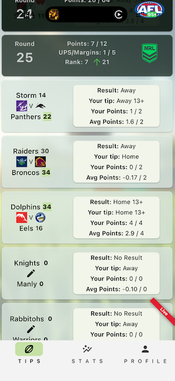
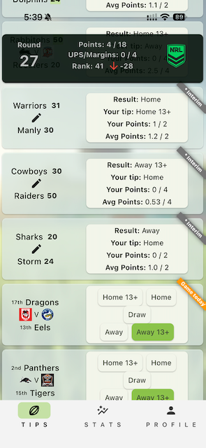
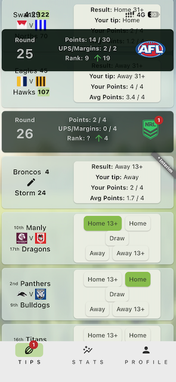
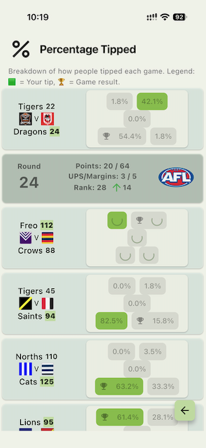

# Adaptive Tips Tab — Implementation Brief

As of 22 September 2026; corrections applied 23 September 2026 and the carousel-peek and app-width decisions recorded 25 September 2026 (all marked inline). Reviewed and written by Claude (Opus 5) for Richard Tozer.

> **This file is a snapshot.** The living copy is the shared doc at
> <https://claude.ai/code/artifact/c478cca0-8c97-4fd2-908e-44cc747bd787> — edits and
> comments there, not here. Re-export if this drifts.

The Tips tab gets three layouts — wide, standard and stacked — chosen from the card's own width and the current text scale, built on a branch off `development`. Two findings change the plan agreed so far: `carousel_slider` cannot size itself to its content, and the tab's scroll position is computed arithmetically from a hardcoded 128px card height in 57 places across 10 files.

## Roles and branch

You implement; I review. The work lands on a branch off `development`, in its own worktree.

- **Implementing agent** — design, prototype, implementation, tests.
- **Reviewer (Claude, separate session)** — critique at the checkpoints in the last section. Does not write implementation code for this.
- **Richard** — decides anything this brief leaves open.

This work lives on `codex/adaptive-tips-prototype`, worktree `/Users/richardtozer/dev/projects/daufootytipping-tips-prototype`, branched from `development` at 793751a. The repo carries several other stale `claude/*` worktrees and branches; prune rather than adding to the pile.

Decide before the first commit whether the prototype is throwaway or the real thing. CLAUDE.md forbids keeping old and new code together, migration layers and versioned names, so a prototype that keeps the current layout beside the new one cannot merge as it stands. Two workable shapes:

- **Throwaway gallery** — a scratch page with sample games and width / text-scale controls, deleted before merge; the learnings reimplemented on a clean branch.
- **Real implementation plus a dev-only harness** — the harness stripped before merge.

Either works. Drifting between them does not.

The 2026 comp closed on 6 September, so this has the longest runway before real tipping traffic. It is UI-only, so the Cloud Functions deploy freeze does not apply, but it still ships through `scripts/promote-to-testing.sh`.

## Decisions already locked

Three layouts, chosen from the card's available width and the current text scale — never from device type. That also covers split-screen, window resizing and rotation.

| Layout | Game information | Tip choices |
| --- | --- | --- |
| Wide | Teams, logos and scores on one row | All five choices alongside |
| Standard | Current stacked team panel, unchanged | Current 2 / 1 / 2 arrangement |
| Stacked | Matchup above the choices, names and scores wrapping | Five full-width buttons, vertical |

Rules agreed with Richard:

- Standard preserves the current phone arrangement — team panel, button arrangement, styling and swipe behaviour.
- Swiping between Tips, Result and Info stays. Visible segment controls were considered and set aside.
- The two halves adapt independently. There is a useful middle ground where the matchup sits above the current button arrangement; dropping straight from standard to five stacked buttons makes cards needlessly tall.
- "Smallest components" means simpler grouping, not smaller text or smaller touch targets. Keep the user's chosen text size and let the card grow.
- Adjacent cards use the same arrangement. One long team name must not flip a single card; wrap within the chosen arrangement instead.
- Wide is permission to fit inline, not a requirement. Long venue names and large text still wrap.
- Each score stays visually attached to its team.
- Choice order is identical in all three layouts, including selected, saving and disabled states: Home 13+, Home, Draw, Away, Away 13+ (`GameResult.a` through `GameResult.e`).

Transition thresholds come from measurement in the prototype, not from guessed device categories. Print the measured minimum width for each layout so it can be hardcoded with confidence.

### Carousel peek and layout breakpoints — decided 25 September 2026

The carousel viewport fraction is **0.9 in all three modes**, not 0.8. This affects production, not just the prototype.

The 20% strip the old value reserved showed nothing. `enlargeCenterPage: true` with `CenterPageEnlargeStrategy.zoom` scales the off-centre pages small enough that they sit inside the reserved strip rather than filling it, so at rest the strip is empty card background. The same absence appears in the baseline screenshots above, so it is inherited from production rather than introduced here. The peek was notional, and the width it cost was real.

What it bought: at 390px and 2.5× text the tip buttons stay in the paired 2 / 1 / 2 arrangement instead of dropping to five stacked rows, and the card falls from 561px to 481px.

**The breakpoints moved with it.** They are derived by dividing content width by the fraction:

```
wideMin = inlineTeamWidth + inlineChoicesWidth / fraction + 8
```

A larger fraction divides by more, so the threshold drops. `wideMinWidth` at 1.0× went from 801 to at most 768, and 768px — iPad portrait — flipped from standard to wide: inline matchup, results reflowed to two rows, roughly double the games per screen. Phone widths (360, 390) stay standard with a slightly wider panel, so the standard-baseline rule above still holds.

That flip is accepted: wide at tablet width is what wide mode is for, and nothing is hidden. It must be pinned by test rather than left as a property of the formula — see the checklist below.

**Still open:** with no visible peek in any mode, nothing statically tells a user that Result, Info and Tips sit behind a swipe. That predates this work and applies to the shipped app. Making the peek real — reducing `enlargeFactor`, changing the enlarge strategy, or trimming the panel `Card` margin — remains available and would be a separate decision.

## App width policy and integration sequence — decided 25 September 2026

The 500px cap at `main.dart:535` was an expedient fix to stop the phone layout stretching across a desktop browser, not a considered constraint. It wraps `MaterialApp.home`, so all three tabs are capped and centred.

**The rule replacing it: the app grows until the game card fits inline — the wide arrangement — and no further.** Past that width, extra space only stretches whitespace. Where a display is too narrow to reach the inline threshold, the app uses what is available and stays standard or stacked.

Measured against the prototype's sample data. These are sample numbers, not universal limits; real comp data will shift them.

| Text scale | Standard from | Wide from | Mode at 500px |
| --- | --- | --- | --- |
| 1.0× | 334 | 743 | standard |
| 1.5× | 458 | 986 | standard |
| 2.0× | 582 | 1234 | stacked |
| 2.5× | 707 | 1482 | stacked |
| 3.2× | 881 | 1829 | stacked |

### Deriving the width without making the app resize itself

`wideMinWidth` comes from `TipsCardLayout.measure()`, which reads team names, ranks and scores — all of which change. Team names are stored data (`team.dart:20`), not a fixed list, so a hardcoded worst case would drift from reality. Measure a **bounded worst case per field** rather than current values:

- **Team name** — widest across all teams in the loaded comp, not just the visible games.
- **Rank** — the widest ordinal string, which is bounded.
- **Score** — a fixed three-digit allowance, never the live number.

The width is then a function of comp and text scale alone. Recompute on comp load and on text-scale change, cache otherwise. A score ticking from 98 to 105 can never move it.

**One measurement, not two.** The cap and the mode decision must come from the same call. If they disagree by a rounding step, the app sits at its own maximum width still rendering stacked — the most irritating possible failure, and invisible to the current tests. Size the gutter above the threshold so the wide layout never sits at its exact minimum.

### Six screens sit outside the cap

`LeagueLadderPage`, `TeamGamesHistoryPage`, `StatRoundGameScoresForTipper`, `StatRoundLeaderboard`, `StatPercentTipped` and `RoundMissingTipsStats` are pushed as siblings of `home` in MaterialApp's Navigator, so the wrapper never reaches them and they render full-width today. Holding the shell consistent across tabs does not cover them, because they are not tabs. At 500px that inconsistency reads as an accident; at a deliberate 743 it will read as a bug. Decide whether the policy applies to them.

A consistent outer width does not require every screen's content to stretch. The shell and navigation can hold one width while forms and profile content stay narrower inside it.

### Sequence

1. **Integrate the adaptive Tips card under the existing 500px cap.** This carries the real risk — extent cache, startup scroll, sticky-header arithmetic — and is independent of width policy. Stacked already engages at 500px from 2× text, so large-text users benefit immediately; wide stays dormant.
2. **Replace the cap with the derived maximum.** This is also what switches wide on, so the two are one change, reviewed together.
3. **Review Stats, Profile and the pushed pages at the new width.** `DataTable2` was repaired recently in `8e90843` and needs its own check.

This makes wide mode load-bearing: it defines the app's width policy rather than being an optional extra.

## Baseline screenshots: the states that must survive

Four phone screenshots from the end of the 2026 comp, at default text size. They document states a synthetic gallery would not produce, so use them twice over: as the reference for the current standard arrangement, and as the sample-data matrix the prototype has to cover. They carry Richard's own rank, points and tips — worth knowing before the doc is shared further.









| State | Where it shows | What every layout must render |
| --- | --- | --- |
| Tippable, pre-kickoff | Dragons v Eels | Five chips; ladder rank prefix before each team name ("17th", "2nd") |
| Tip selected | Away 13+, green | Selected styling, identical order in all three layouts |
| Final result | Storm 14 / Panthers 22 | Four label-and-value rows: Result, Your tip, Your Points, Avg Points |
| Interim crowd-sourced score | Warriors 31 / Manly 30 | Grey "Interim" corner banner |
| Live, no score yet | Rabbitohs 0 / Warriors 0 | Red "Live" corner banner, "Result: No Result" |
| Editable live score | Knights 0 / Manly 0 | Pencil in the middle row; the whole panel is the tap target |
| Starting soon | Dragons v Eels, round 27 | Orange 'Game today' corner banner over the chips |
| Percent stats, loaded | Tigers 45 / Saints 94 | Five percentage chips; trophy marks the result, green marks your tip |
| Percent stats, loading | Freo 112 / Crows 88 | Blank chips at full footprint |
| Round header | Rounds 24 to 27 | Points, UPS/Margins, Rank with delta arrow, league roundel, unread badge |

### What they change in this brief

**The narrow sketch was a regression.** Team name and score already share a line today — "Tigers 22", "Dragons 24". The original stacked sketch split them onto separate lines. Keep the pair together: home name and score, then the logos, then away name and score.

**Wide mode needs a plan per panel, not just for the chips.** The swipeable area holds four different contents: five chips (Tips), four label-and-value rows (Result), Info, and five percentage chips (Percentage Tipped). The layout table above describes only the chips.

**Three corner banners, not one.** `'* Interim'` in grey, `'Live'` in the AFL colour, and `'Game today'` in orange for `GameState.startingSoon` — `user_home_tips_gamelistitem.dart:408-436` and `:459`. All pinned `BannerLocation.topEnd`, all sitting over the right-hand panel. In wide mode that corner is where the tip chips go.

**Loading states must hold their footprint.** Percentage chips render blank while stats arrive. That is free with a fixed extent per mode; with measured heights, cards would resize as stats land.

**The sticky-header overlap is real.** The third screenshot shows the Round 25 header sitting over the card behind it. There is already a branch for it, `codex/sliver-sticky-header-overlap`. Do not inherit it, and do not let the layout change hide it.

**There is no baseline for the cases this work targets.** All four are phone, portrait, default text. iPad, web, landscape, large text and any foldable have nothing to compare against. Capture equivalents on the current build before changing anything.

## Correction: the carousel cannot size to its content

The option chosen in the earlier discussion — "keep swiping, with the active panel determining its height" — is not achievable with the current package, and it was offered as the conservative choice.

`CarouselSlider` wraps a `PageView` in either a fixed-height `Container` or an `AspectRatio` (`carousel_slider-5.1.1/lib/carousel_slider.dart:191-195`). `CarouselOptions` exposes `height` and `aspectRatio` and nothing else. There is no intrinsic sizing path: a page's content cannot drive the carousel's height. The call site passes `height: Game.gameCardHeight - 8` at `lib/pages/user_home/user_home_tips_gamelistitem.dart:369`.

So the height has to come from outside the carousel — but that does not require replacing the package. Measuring the active page and feeding the result back into `CarouselOptions.height` gives active-page sizing while keeping `carousel_slider` and its `enlargeCenterPage: true`, `enlargeFactor: 1.0` and `CenterPageEnlargeStrategy.zoom`, including the neighbouring-page peek that narrows the usable panel. A `PageView` swap is one way to get there, not the only way. *(Corrected 23 September 2026: this brief originally said active-page sizing required a package swap. It does not.)*

Re-decide before writing code. Three options, in ascending cost:

1. **One height per layout mode.** Keep `carousel_slider`, pass a computed `height`. Cheapest, and the recommendation below.
2. **Height = the tallest panel for that game at the current width and text scale.** Still `carousel_slider`, but measured per card. Card heights become variable, which pulls in everything in the next two sections.
3. **Replace `carousel_slider` with a `PageView`** and size to the active page. Only needed if external height measurement proves insufficient; most expensive, and it discards the zoom and peek behaviour that standard mode is supposed to preserve.

## Recommended approach: parameterise the extent before measuring it

Try this first. It delivers all three layouts without touching the scroll architecture at all, and nobody raised it in the earlier discussion.

Keep `SliverFixedExtentList`. Compute the card extent once per list build from the layout mode and the current text scale, instead of reading a hardcoded `128`.

Every offset calculation in the next section keeps working, because they all reference one constant — parameterise that constant and they come along. Wide mode then gets a genuinely shorter card, roughly one row instead of three, so landscape and tablets show more games per screen. That is a real gain the earlier discussion missed.

What you give up is per-game height variation: inside one layout mode every card is as tall as the tallest content in that mode. That is already what happens today at 128px, so it stays closer to the current phone arrangement than measured heights would.

Sketch:

1. Resolve `(layoutMode, textScale)` once, near where the sliver list is built, from the card's own constraints — a `LayoutBuilder` around the list, not `MediaQuery.of(context).size`.
2. Derive `cardExtent` from that pair as a pure function, unit-testable with no widget tree.
3. Thread `cardExtent` through `TipsLeagueSection` in place of `Game.gameCardHeight`.
4. Feed the same value into the carousel's `height`.

Move to measured per-card heights only if the prototype shows the fixed extent visibly failing — most likely stacked mode, long team names, largest text. If it does fail, the replacement for offset arithmetic is index-based scrolling, such as `scrollable_positioned_list`. *(Corrected 23 September 2026: this brief originally also offered `ensureVisible` on keyed items. That does not work here — an unbuilt child of a lazy sliver list has no `BuildContext` to scroll to.)* Either way it is its own piece of work with its own review, not something to fold into the layout change.

## Where fixed heights are assumed

`Game.gameCardHeight = 128` and `Game.teamVersusTeamWidth = 135` are defined at `packages/dau_shared/lib/models/game.dart:29-30`. The Tips tab does not merely render a list — it predicts scroll offsets arithmetically from those constants. 57 references across 10 files, five of them tests.

| What it does | Where |
| --- | --- |
| Fixed item extent for the game list | `user_home_tips_gamelist.dart:358` |
| Section body extent = `games.length * gameCardHeight` | `user_home_tips_gamelist.dart:61`, `:94` |
| Scroll to first untipped or first live game = `index * gameCardHeight` | `user_home_tips_gamelist.dart:185-211` |
| Startup scroll target = sum of section extents | `user_home_tips.dart:330-344` |
| Header top offset = sum of section extents | `user_home_tips.dart:440-448` |
| End-footer startup offset | `user_home_tips.dart:373-378` |
| Sticky-header push-up = `nextHeaderTop - scrollOffset` | `user_home_tips.dart:451-483` |
| `DAUComp.pixelHeightUpToRound()`, UI arithmetic on a shared model | `dau_shared/lib/models/daucomp.dart:126` |
| Fixed team panel width | `user_home_tips_gamelistitem.dart:258`, `:284` |
| Carousel height | `user_home_tips_gamelistitem.dart:369` |

Two things worth knowing before you touch any of it.

There is already a retry loop — `_scheduleStartupScrollAttempt` at `user_home_tips.dart:144`, bounded by `_maxStartupScrollRetries` — which exists because the predicted offset does not reliably match reality even today. Anything that makes heights less predictable makes that loop less likely to settle.

`gameCardHeight` and `teamVersusTeamWidth` sit in `packages/dau_shared`, which `functions_dart` also depends on (`functions_dart/pubspec.yaml:15`). Layout constants in a package shared with Cloud Functions. Move them into the Flutter app whichever approach you pick, and take `DAUComp.pixelHeightUpToRound()` with them — it has exactly one production caller, `user_home_stats_percent_tipped.dart:68`, so the audit is small. *(Corrected 23 September 2026: this brief originally named that method `getPixelHeight()`.)*

Tests that reference the fixed extents and will need updating: `daucomp_pixelheight_test.dart`, `daucomp_model_test.dart`, `dauround_test.dart`, `user_home_tips_extent_cache_test.dart`, `user_home_tips_scroll_target_test.dart`, `user_home_navigation_test.dart`.

## Traps not yet covered

None of these came up in the earlier discussion. All line references are in `lib/pages/user_home/`.

**The existing width check measures the wrong box.** `shouldShowTextTeamInfo()` at `user_home_tips_gamelistitem.dart:747` decides whether to show scores, ranks and logos from `MediaQuery.of(context).size.width` — the whole window — while the panel it governs is pinned to 135px. On an iPad that check passes at the window level and the panel is still 135px. Fixing this is the work, not a side-effect of it. It also *hides* that content below 340px or at text scale 1.3 and above; reflow it instead.

**Hero tag collisions.** The code keeps an invisible zero-height copy of the logo row at `user_home_tips_gamelistitem.dart:725-732`, purely so the `team_icon_<dbkey>` Hero tags always exist for the ladder-page transition. If wide mode renders the matchup inline while that hidden copy survives, you get duplicate Hero tags in one subtree and Flutter throws. Rule: exactly one Hero per team per route. Re-test the ladder push in all three layouts.

**Touch targets versus preserving the standard arrangement.** The chips use `materialTapTargetSize: MaterialTapTargetSize.shrinkWrap` with zero padding, at `user_home_tips_tipchoice.dart:158` and `:317` — already below the 48dp guideline. Enlarging them changes the standard phone arrangement, so the two goals pull against each other. Richard decides which wins; raise it rather than quietly picking.

**Percent-stats mode.** The same card renders on the Stats tab with `isPercentStatsPage: true`: `carouselItems()` returns a single card (`:498`) and `TipChoice` draws percentage chips instead of choice chips. Every layout change hits two surfaces. Budget for it.

**Banner overlays.** `Banner(location: BannerLocation.topEnd)` for "Live" and "Game today", plus the interim-score `Stack` at `user_home_tips_gamelistitem.dart:459`. Diagonal corner banners over a card whose proportions change per mode — check for clipping and for the banner covering content in wide mode.

**The live-game tap target.** When a game is underway the whole team panel becomes a `GestureDetector` opening the scoring modal (`:247`). In stacked mode that is a large invisible hit area over loose text. Give it a visible affordance.

**Panel identity, not index.** `carouselItems()` does `cards.insert(0, scoringTile)` when a game goes live (`:519`), so index 0 means Tips before kickoff and Result after. `onPageChanged: (index, reason) {}` at `:375` is empty — nothing tracks the page today. Track the panel by identity and restore by identity across resize, rotation and game-state change.

**Semantics and keyboard.** Five chips with no per-game grouping; re-laying out is the cheap moment to add `Semantics`. `_handleKeyEvent` at `user_home_tips.dart:490` already drives scrolling with arrows, space and page up/down, but nothing reaches the chips or the carousel. Wide mode is the web and tablet layout, so that gap is most visible there.

## Rotation, safe area and foldables

Rotation reassesses the layout for free, because width and text scale are the inputs. Phone portrait gives standard; the same phone in landscape gives wide if everything fits; landscape at very large text falls back to standard or stacked. A tablet in split-screen follows its allocated width, not the device. Two gaps the earlier discussion did not reach.

**The scroll signature ignores geometry.** `_lastScrollSignature` at `user_home_tips.dart:106-108` is built from comp key, latest round, tips-loaded and the extent-cache key — not width, not text scale. A rotation will not re-run the scroll target, but it will change `maxScrollExtent`, so the user's position shifts silently. Add width and text scale to that signature, or recompute the target on a geometry change.

**Safe area already perturbs every offset.** `_topSafeInset` is re-read in `didChangeDependencies` (`:60`) and feeds `_welcomeSliverHeight` (`:63`), which every computed offset builds on. Rotating moves the notch to the side and changes that inset, shifting the whole arithmetic. That is a latent bug today; dynamic heights make it worse. Worth a targeted test either way.

**Foldables.** If iPhone Duo is a real target, width alone does not describe the screen. `MediaQuery.displayFeatures` exposes hinge bounds, and a card straddling a fold is a different case from a narrow card. State explicitly whether the prototype handles the hinge or treats each posture as a plain width — "just a width" is a fine v1, but decide it rather than discovering it. Nobody on this brief has hands-on knowledge of that device's geometry, so confirm against real simulator metrics before hardcoding anything for it.

Preserve across rotation: the selected tip, the active panel identity, and the game the user was looking at. Landscape is short on height, so check the round header still leaves room to see and reach games.

## Baseline, done, and review points

**Write goldens before you branch.** Nothing today can detect an unintended layout change — `test/screenshots/` holds manual PNGs from July 2025, not goldens. The baseline screenshots above are a human reference, not a gate. Add golden tests for the Tips tab on `development`, commit them, then branch. Without them every layout shift is judged by eyeball across a worktree boundary.

Minimum matrix: 360, 768 and 1280 logical px, at text scale 1.0 and 1.5. Expect goldens to move whenever a measurement changes — open the regenerated image and confirm the change was intended before committing it.

**Prototype against a multi-round list, not isolated cards.** Sticky round headers, startup scroll and jump-to-untipped are where this breaks, and none of them show up in a single-card gallery.

Definition of done, per CLAUDE.md:

- [ ] `flutter analyze` clean, zero issues
- [ ] `flutter test` passes, including the updated extent and scroll-target tests
- [ ] `dart format lib/` clean
- [ ] `cspell "**"` clean
- [ ] Phone widths still render the standard layout — stacked team panel, 2 / 1 / 2 buttons (a golden may shift with panel width; the arrangement must not)
- [ ] Absolute-width mode assertions pin which layout each width class gets — 360, 390, 430 standard; 768, 834, 1024; 1280 wide — so a formula change that moves a breakpoint fails a test instead of silently rewriting a golden
- [ ] Width policy pinned by assertion — a 2000px window at 1.0× text yields the derived content width with Tips in wide mode, and the width does not move when a score changes
- [ ] No `dynamic`, no `!` without justification, no TODOs, no old code left beside new
- [ ] Verified on web, iPad and a phone: portrait and landscape, default and large text

Outcomes to judge against:

1. The standard phone arrangement is preserved: team panel, 2 / 1 / 2 buttons, swipe behaviour.
2. Narrow widths and large text stay fully usable, with nothing hidden.
3. Resizing, rotating and swiping preserve the selected tip, the active panel and the visible game, with no jumps.

**Review points.** Bring each of these to the reviewer before moving on:

1. **After the carousel decision** — which of the three options, and why.
2. **After the first working prototype** — the measured layout thresholds and the extent strategy, before any of it is wired into the live Tips tab.
3. **Before merge** — the diff, with goldens and the checklist above.
