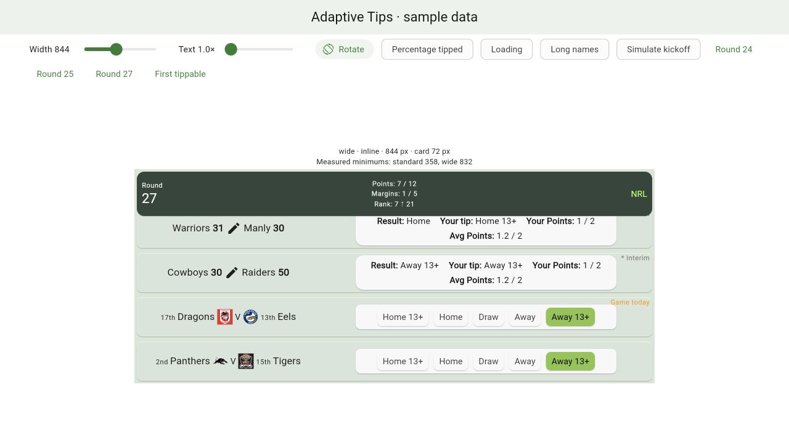

# Adaptive Tips prototype — review checkpoint

23 September 2026. Branch: `codex/adaptive-tips-prototype`, based on `793751a`.

This is the working prototype checkpoint before integration into the live Tips
and Stats lists. The [exported brief](DESIGN-adaptive-tips-tab.md) is unchanged;
[the review notes](REVIEW-adaptive-tips-tab.md) remain proposed amendments for its
living copy. The user authorized starting this prototype after that review.

## Run and inspect

```sh
flutter run -d web-server --web-hostname 127.0.0.1 --web-port 9876 \
  -t lib/dev/adaptive_tips_prototype.dart
```

The current local preview is at <http://127.0.0.1:9876>. It uses synthetic data,
does not initialize Firebase, and never writes tips or scores to a backend.

Use the width and text controls, Rotate, Percentage tipped, Loading, Long names
and Simulate kickoff. Navigation buttons move between the sample rounds and to
the first tippable game. Swipe each card's right/bottom panel as usual; keyboard
focus also supports left/right arrows. Selecting a tip simulates a short save.
The matchup opens an explanatory sample dialog, not the live scoring modal.

The requested width is capped by available browser space. The diagnostics show
the actual width, selected layout and measured transition thresholds.

## Implemented experiment

- The existing carousel package, zoom and neighboring-page preview are retained.
- One calculated extent applies to all games at the current geometry. Swiping
  never changes card height; width, text or sample-content changes may do so.
- Matchup and button arrangements adapt separately, including matchup above a
  paired button panel when five vertical buttons would be unnecessary.
- Only panels present on the selected surface participate in sizing. Results
  sum their actual styled rows; team measurements include actual ranks and scores.
  Repeated text measurements are reused within each sizing pass.
- Rotation restores the visible game relative to the sample sticky header,
  clamped at list boundaries. It does not repeat startup navigation.
- Panel identity is retained when a Result panel is inserted at simulated kickoff.
- Percentage loading reserves the same label footprint as loaded values.
- Percentage chips show the tip name beneath the value in smaller, readable
  text. These captions remain visible during loading and respect text scaling.
- Cards expose grouped semantics and the carousel supports keyboard arrows.
- Standard ribbons are retained. Wide cards currently show status text at the
  upper right to keep ribbons off the inline controls; this needs visual review.

Initial measurements with the normal synthetic dataset, resolved app typography
and text size 1.0:

| Surface | Standard minimum | Wide minimum | Example extent |
| --- | --- | --- | --- |
| Tips | About 358 logical px | About 832 logical px | 128 px at 390 wide; 72 px at 844 wide |
| Percentage Tipped, with captions | About 411 logical px | About 909 logical px | Depends on the same panel-height calculation |

These are measured prototype values, not final device breakpoints. Text scaling,
font metrics and the shared dataset change them. All games use the same choice
for a given list; a single long team name cannot switch just its own card.



## Scope and validation

The only change to an existing production component is extracting the original
2 / 1 / 2 arrangement from `TipChoice` into `TipsChoicePanel`. An automated golden
of the original 390 px card was captured before that extraction and remains
unchanged afterwards. It uses SDK Roboto fonts rather than the placeholder test
font. The four supplied screenshots remain untouched human references.

`AdaptiveTipsCard` is a presentation component ready for adapter review. The
normal app entry point does not import the development harness. The harness uses
fixed-extent slivers and grouped sticky headers, so it validates the sizing idea
but does not yet validate modifications to the production scroll implementation.

Checks cover:

- 240–1280 logical pixel examples and text scaling up to 3.2, including long names.
- Values immediately either side of measured transitions.
- Upcoming, final, live, interim, selected and percentage-loading sample states.
- Stable height while swiping; selected tip and panel identity across resize/kickoff.
- Keyboard carousel navigation and visible-game restoration in the sample list.
- Existing Tips/card/navigation regression tests and the unchanged standard golden.
- Browser inspection of standard, wide and narrow states; no runtime errors in
  the inspected session.

Final verification: `flutter analyze --no-pub` reports zero issues and
`flutter test --no-pub` passes all 443 tests. The changed source and this handoff
are also spell-checked. This is prototype validation, not a merge/release sign-off.

After adding percentage captions, analysis and the 18 responsive/baseline tests
were rerun successfully. The 443-test full run above predates that small change.

After refining content-based heights, all 21 responsive/baseline checks pass,
including 2.5× text and a regression for one tall results row. Team logos and
card icons scale with text; result values prefer wrapping after the colon.
The full-suite run above predates these refinements.

## Review before live integration

1. Assess the measured thresholds and whitespace from uniform card heights,
   especially when a tall button panel shares a carousel with short Result text.
2. Review wide status text versus diagonal banners and the intermediate paired
   layout. Standard chip geometry is preserved; enlarged touch targets still
   need device review where standard spacing is tight.
3. Decide whether to retain uniform extents before adapting the live section,
   startup-navigation and sticky-header arithmetic. Keep existing live data,
   permissions, default-tip help, warning dialogs and score-edit behavior in
   their adapters; the prototype does not replace those behaviors.
4. Add production-level visual baselines for more than the one automated card,
   and verify iPhone/iPad portrait/landscape on devices or simulators. Browser
   width presets are not a claim of native-device validation.
5. Hinge-specific layout is not implemented. Confirm real reported display
   features before adding posture-specific behavior.

## Review follow-ups

- Local checkpoint `71de084` preserves the reviewed prototype before these changes.
- Layout measurement now receives each card's league-derived choice labels from
  the same GameResult options used by rendering, with regression coverage for
  longer labels. No separate AFL-margin strings remain in the layout calculator.
- Added 18 multi-round list snapshots: 360/768/1280 px × 1.0/1.5 text,
  each at startup, a round boundary, and after jumping to the first tippable game.
  Navigation assertions check target visibility beneath the pinned header.
  These baseline the prototype, not the as-yet-unmodified production navigation.
- The rendered NRL paired row at 2.5× needs approximately 309.3 px including
  margins and spacing. At a 390 px display the carousel provides only 305.6 px.
  The paired threshold therefore remains unchanged: lowering it alone would
  overflow. A further reduction in whitespace needs a separately reviewed change
  to button spacing or carousel width, while preserving uniform panel heights.
- List goldens load Material icons; ribbon text explicitly uses the app font
  rather than the test renderer's default font. Status placement is unchanged.
- Final follow-up verification: analysis reports no issues and all 454 tests
  pass, including comparison against the 18 new list goldens. The headless
  font environment still displays the sample header's upward-arrow character
  as a fallback glyph; native font rendering remains a device-review item.

No pushes, merges or releases have been made. No bulk formatter was run.

## Stacked peek experiment — 25 September

Stacked mode now permits a viewport fraction of 0.82 instead of 0.80 only when
the additional width allows paired buttons. Other cases keep 0.80, including
all standard and wide layouts. Button spacing and uniform panel heights are
unchanged. Plain stacked button measurements remove the legacy 16 px excess
allowance, checked against the app's rendered chip widths. Percentage-chip
allowances remain unchanged.

At 390 px and 2.5×, this provides 313.24 px for the approximately 309.3 px
paired row. Each side's reserved peek shrinks from 38.2 to 34.38 px. The earlier
conclusion that this setting must use vertical buttons is superseded by this
experiment. Tests cover adjacent widths/text sizes and three additional list
goldens at this exact setting. Whether the smaller peek remains a sufficiently
clear swipe cue still needs human interaction review.

## Selected design — wider stacked panels

Richard selected option 2 following the review: stop reserving as much width
for neighbouring pages that the inherited zoom effect hides at rest. This
supersedes the conditional 0.82 experiment above. All stacked panels now use
0.90, including the percentage surface; standard and wide retain 0.80.
At 390 px the active page receives 343.8 px before its internal margins.
Swiping, zoom, button spacing and shared panel heights are retained. The
rendered-width correction remains independent of the viewport decision.
No new static swipe cue is introduced; discoverability remains inherited
behaviour, explicitly accepted for this prototype decision.

The previous experiment is saved in checkpoint `9259f5f`. Updated stacked
goldens cover the selected design; the standard/wide references are unchanged.

### Follow-up: apply 90% to every layout

Richard subsequently requested the same ratio for standard and wide mode.
All prototype carousel panels now use 0.90. Width thresholds and panel text
measurements use that same ratio, so standard and wide arrangements can become
available at narrower widths. This supersedes the standard/wide exception above.
Updated list goldens capture the intentional change; the original production
card golden remains unchanged because live integration is still pending.
